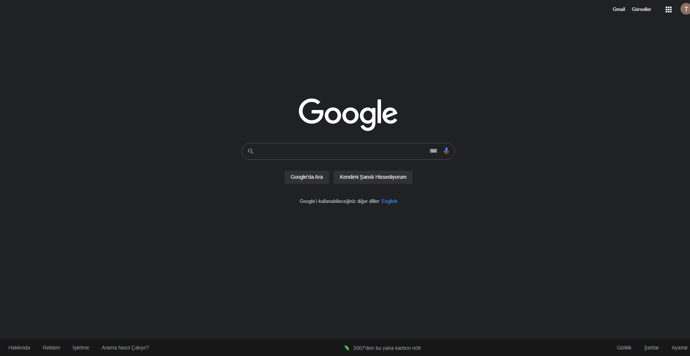

# Kodluyoruz Front End :one::zero::one:
Merhaba,  Ben [Tolga](https://github.com/tolgaaltinordu)! [Kodluyoruz](https://www.kodluyoruz.org/) Bootcamp hazırlık programındayım ve [Patika.dev](https://www.patika.dev/tr) üzerinden aldığım derslerin ödevlerini buradan paylaşıyorum. 

## HTML

### HTML - Odev  - 1
İlk Web Sayfamızı Oluşturmak: [:link: ödev linki](https://github.com/tolgaaltinordu/Kodluyoruz-Frontend-101/blob/main/HTML-Dersleri/Odev1/index.html)

### HTML - Odev - 2
Liste Kullanımı, görsel ve link Eklenmesi: [:link: ödev linki](https://github.com/tolgaaltinordu/Kodluyoruz-Frontend-101/blob/main/HTML-Dersleri/Odev2/index.html)
### HTML - Odev - 3
CSS'e giriş çalışması [:link: ödev linki](https://github.com/tolgaaltinordu/Kodluyoruz-Frontend-101/blob/main/HTML-Dersleri/odev%203/index.html)
### HTML - Bolum Sonu Calismasi
Semantic HTML etiketleri kullanımı[:link: ödev linki](https://github.com/tolgaaltinordu/Kodluyoruz-Frontend-101/tree/main/HTML-Dersleri/Bolum%20Sonu%20Calismasi)
## CSS
### CSS - Odev - 1
CSS'in Kullanımı:[:link: ödev linki](https://github.com/tolgaaltinordu/Kodluyoruz-Frontend-101/tree/main/CSS-Dersleri/Odev1)
### CSS - Odev - 2
Google 1998: [:link: ödev linki](https://github.com/tolgaaltinordu/Kodluyoruz-Frontend-101/tree/main/CSS-Dersleri/Odev2)

### CSS - Odev - 3
Google: [:link: ödev linki](https://github.com/tolgaaltinordu/Kodluyoruz-Frontend-101/tree/main/CSS-Dersleri/Odev3)

## Bootstrap
### Bootstrap - Odev - 1
Bootstrap ile ilk web sayfası tasarımı: [:link: ödev linki](https://github.com/tolgaaltinordu/Kodluyoruz-Frontend-101/tree/main/Bootstrap-Dersleri/Odev1) 

## JavaScript
### JavaScript - Odev - 1
Javascript ile saat yapımı : [:link: ödev linki](https://github.com/tolgaaltinordu/Kodluyoruz-Frontend-101/tree/main/JavaScript%20-%20Dersleri/Odev1)